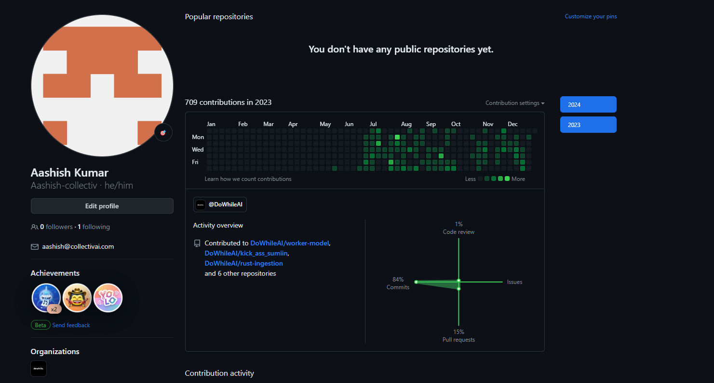

# Welcome to Aashish's GitHub Contributions Repository!

## This repository serves as the GitHub contribution aggregator reflecting the development activity undertaken during my tenure at the Dowhile Internship.

This repository has been created using [sync-contribution-graph](https://github.com/kefimochi/sync-contribution-graph), a tool for migrating GitHub contributions. It contains all public/private contributions made by Aashish as of Mon, 04 Mar 2024 08:03:11 GMT.